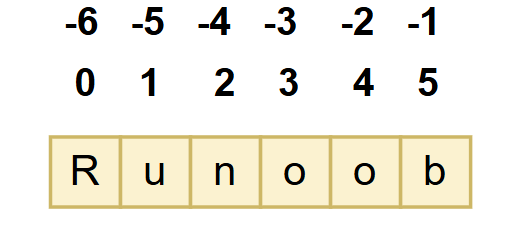
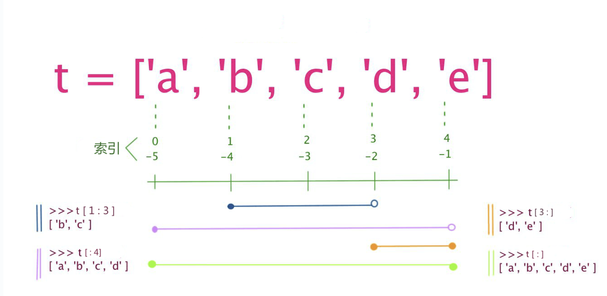
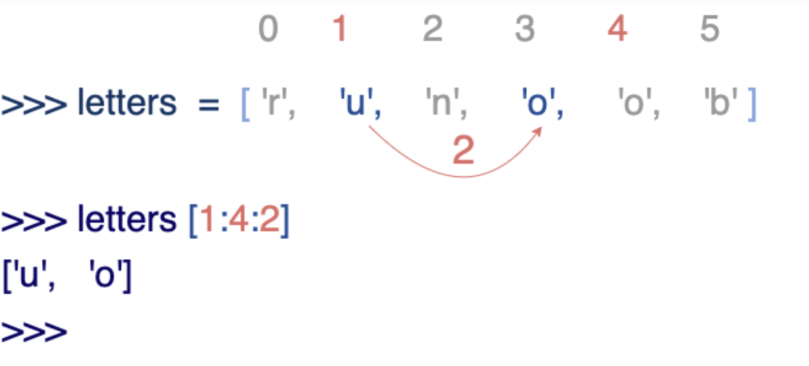

# 🐍 Python 基本資料型別

在 Python 中，變數不需要事先宣告。  
每個變數在使用前都必須**先被賦值（assign value）**，變數才會被建立。

> 📘 Python 的變數沒有「明確型別」，它的型別取決於**變數所儲存的資料**。
>
> 我們所說的「型別」指的是 — 變數在記憶體中對應物件的資料型別（Data Type）。

等號（`=`）用來進行「賦值運算」：  
左邊是變數名稱，右邊是要儲存的值。

## ✨ 範例

~~~python
counter = 100        # 整數變數
miles = 1000.0       # 浮點數變數
name = "runoob"      # 字串變數

print(counter)
print(miles)
print(name)
~~~
### **輸出：**
~~~yaml
100
1000.0
runoob
~~~

## 🔹 多個變數賦值（Multiple Assignment）

Python 允許你**同時為多個變數進行賦值**。  
### 例如：

~~~python
a = b = c = 1
~~~
這樣的寫法會同時建立三個整數變數 a、b、c，
並且讓它們都指向相同的整數物件 1。

## ✨ 也可以為多個物件指定給多個變數

~~~python
a, b, c = 1, 2, "runoob"
~~~

### **在這個例子中：**
- 1 被分配給變數 a
- 2 被分配給變數 b
- "runoob" 被分配給變數 c

這種語法稱為**多重賦值（Multiple Assignment）**，
在 Python 中非常常見，也常用於交換變數或解構序列。

## 🧩 範例

~~~python 
# 變數定義
x = 10             # 整數型
y = 3.14           # 浮點數
name = "Alice"     # 字串
is_active = True   # 布林值

# 多變數賦值
a, b, c = 1, 2, "three"

# 檢查變數型別
print(type(x))          # <class 'int'>
print(type(y))          # <class 'float'>
print(type(name))       # <class 'str'>
print(type(is_active))  # <class 'bool'>
~~~

 

# 🧱 標準資料型別（Standard Data Types）

在 Python3 中，常見的資料型別有：

- **Number（數字）**
- **String（字串）**
- **Bool（布林值）**
- **List（列表）**
- **Tuple（元組）**
- **Set（集合）**
- **Dictionary（字典）**

## 📂 六大標準資料型別分類

Python3 的六種主要資料型別可以分為兩大類：

### 🔒 不可變資料型別（Immutable）
這些型別的值**一旦建立就不能被修改**：

- `Number`（數字）
- `String`（字串）
- `Tuple`（元組）

~~~python
x = 10
x = 20   # 其實是建立新的數值物件並讓變數指向它，不是修改原物件
~~~

### 🔓 可變資料型別（Mutable）
這些型別的內容**可以被更改**：

- `List`（列表）
- `Dictionary`（字典）
- `Set`（集合）

~~~python
fruits = ["apple", "banana"]
fruits.append("cherry")  # ✅ 可修改內容
print(fruits)
~~~

## 💡 延伸補充

除了上述六種標準型別外，Python 還有一些**高階資料型別**，例如：

- `bytes`（位元組序列）
- `bytearray`（可變位元組序列）
- `memoryview`（記憶體檢視物件）

## 🧠 小結
| 類別 | 型別 | 是否可變 | 範例 |
|:------|:------|:-------------:|:----------------|
| 數值型 | `int`, `float`, `complex` | ❌ | `10`, `3.14`, `1+2j` |
| 字串型 | `str` | ❌ | `"hello"` |
| 布林型 | `bool` | ❌ | `True`, `False` |
| 序列型 | `list`, `tuple` | ✅ / ❌ | `[1,2,3]`, `(1,2,3)` |
| 集合型 | `set` | ✅ | `{1,2,3}` |
| 映射型 | `dict` | ✅ | `{"name": "Alice", "age": 18}` |

> ### 📝 **重點**
> - Python 中幾乎所有東西都是物件（Object）。
> - 不可變資料型別修改值時會建立新物件。
> - 可變資料型別可以原地修改內容。
> - 使用 `type()` 可檢查資料型別，使用 `id()` 可查看物件的記憶體位址。

 

# 🔢 Number（數字）

Python3 支援 **int**、**float**、**bool**、**complex（複數）** 四種數值型別。

## 📘 數值型別說明

在 Python 3 中，只有一種整數型別 `int`，不再區分 `int` 與 `long`（Python 2 中存在）。  
像多數語言一樣，數值型別的賦值與計算都非常直觀。

可使用內建函式 `type()` 來查看變數的型別。

~~~python
a, b, c, d = 20, 5.5, True, 4+3j

print(type(a), type(b), type(c), type(d))
# 輸出：
# <class 'int'> <class 'float'> <class 'bool'> <class 'complex'>
~~~

## 🧮 數值運算（Arithmetic Operations）

Python 支援基本的四則運算與其他數學運算。  
以下是常見運算子：

| 運算子 | 說明 | 範例 | 結果 |
|:--------:|:------|:--------|:--------|
| `+` | 加法 | `5 + 4` | 9 |
| `-` | 減法 | `4.3 - 2` | 2.3 |
| `*` | 乘法 | `3 * 7` | 21 |
| `/` | 除法（回傳浮點數） | `2 / 4` | 0.5 |
| `//` | 取整除（回傳整數） | `2 // 4` | 0 |
| `%` | 取餘數 | `17 % 3` | 2 |
| `**` | 指數（次方） | `2 ** 5` | 32 |

## 📍 範例程式

~~~python
# 四則運算示範
print(5 + 4)      # 加法 → 9
print(4.3 - 2)    # 減法 → 2.3
print(3 * 7)      # 乘法 → 21
print(2 / 4)      # 除法（浮點）→ 0.5
print(2 // 4)     # 整除 → 0
print(17 % 3)     # 取餘數 → 2
print(2 ** 5)     # 次方 → 32
~~~

## 💡 延伸補充
- Python 中的布林值 `True` 與 `False` 實際上屬於整數子類型，對應 `1` 和 `0`。
- 複數使用 `j` 表示虛部，例如 `4 + 3j`。
- 可以使用 `abs()`、`pow()`、`round()` 等函式進行常見數學操作。
- 若需更進階的數學運算，可導入內建模組 `math` 或 `cmath`（支援複數運算）。

 

# 🔤 字串（String）

在 Python 中，字串可以使用 **單引號** 或 **雙引號**。  
需要表示特殊字元（如換行 `\n`）時，可以使用 **反斜線 `\`** 來轉義。

## ✂️ 字串索引與切片

字串的取值語法如下：

~~~
變量[起始索引 : 結束索引]
~~~

- 索引從 **0** 開始，負數代表從尾端往回數。
- `-1` 表示最後一個字元。

### 🧭 索引示意圖

## ✨ 範例

~~~python
string = 'Runoob'  # 定義一個字串變數

print(string)         # 輸出整個字串
print(string[0:-1])   # 從第一個到倒數第二個（不含最後一個）
print(string[0])      # 取出第一個字元
print(string[2:5])    # 取出索引 2 到 4 的字元（不含索引 5）
print(string[2:])     # 從索引 2 開始取到結尾
print(string * 2)     # 重複兩次
print(string + "TEST") # 字串拼接
~~~

### **輸出：**

~~~yaml
Runoob
Runoo
R
noo
noob
RunoobRunoob
RunoobTEST
~~~

## 🧩 字串轉義與原始字串

Python 使用反斜線 `\` 轉義特殊字元。  
若不想讓反斜線生效，可以在字串前加 **r** 表示「原始字串」。

~~~python
print('Ru\noob')     # 反斜線換行
print(r'Ru\noob')    # 原始字串，不轉義
~~~

### **輸出：**

~~~yaml
Ru
oob
Ru\noob
~~~

## 📏 字串索引練習

Python 沒有單字元型別，一個字母也是字串。

~~~python
word = 'Python'
print(word[0], word[5])   # 正向索引
print(word[-1], word[-6]) # 反向索引
~~~

### **輸出：**

~~~yaml
P n
n P
~~~

## ⚠️ 字串是不可變的

在 Python 中，字串屬於「不可變類型」。  
一旦建立，內容就不能修改。

~~~python
word = "Python"
word[0] = "m"  # ❌ 錯誤：字串不能直接改變內容
~~~

## 🧠 小結

1. 反斜線可用於轉義，或使用 `r''` 禁止轉義。  
2. 字串可用 `+` 連接、`*` 重複。  
3. 支援正向（0 開始）與反向（-1 結尾）索引。  
4. Python 的字串是不可變物件。  

 

# 🧱 列表（List）

**List（列表）** 是 Python 中使用最頻繁的資料型別之一。

- 列表可儲存多個元素，元素之間可為不同型別（整數、字串、浮點數、甚至巢狀列表）。  
- 列表使用方括號 **`[]`** 表示，元素之間用逗號分隔。  
- 與字串一樣，列表可被索引、切片。  
- 被切片後會回傳新的子列表。

## ✏️ 列表索引語法

~~~
變量[起始索引 : 結束索引]
~~~

- 索引從 **0** 開始。  
- 負索引（如 `-1`）代表從末尾開始。

## ✨ 範例 1：列表的基本操作

~~~python
# 定義列表
lst = ['abcd', 786, 2.23, 'runoob', 70.2]  
tinylist = [123, 'runoob']

print(lst)           # 輸出整個列表
print(lst[0])        # 第一個元素
print(lst[1:3])      # 從第二到第三個（不含第四）
print(lst[2:])       # 從第三個到結尾
print(tinylist * 2)   # 重複兩次
print(lst + tinylist)# 串接兩個列表
~~~

### **輸出：**

~~~yaml
['abcd', 786, 2.23, 'runoob', 70.2]
abcd
[786, 2.23]
[2.23, 'runoob', 70.2]
[123, 'runoob', 123, 'runoob']
['abcd', 786, 2.23, 'runoob', 70.2, 123, 'runoob']
~~~

## 🧩 範例 2：列表是可變的（Mutable）

與字串不同，列表中的元素可以修改、刪除或替換。

~~~python
a = [1, 2, 3, 4, 5, 6]
a[0] = 9
a[2:5] = [13, 14, 15]
print(a)

a[2:5] = []  # 清除區間內元素
print(a)
~~~

### **輸出：**

~~~yaml
[9, 2, 13, 14, 15, 6]
[9, 2, 6]
~~~

## ⚙️ 列表常見特性

1. 列表使用方括號 `[]` 包裹，元素以逗號分隔。  
2. 與字串類似，可使用索引與切片。  
3. `+` 可拼接，`*` 可重複。  
4. 列表是可變資料型別。

## 🧮 範例 3：切片的第三個參數（步長）

Python 的列表切片語法可接收三個參數：
~~~
list[start:end:step]
~~~

第三個參數 `step` 表示步長。

範例：

~~~python
letters = ['r', 'u', 'n', 'o', 'o', 'b']
print(letters[1:4:2])
~~~

### **輸出：**

~~~yaml
['u', 'o']
~~~

## 🔁 範例 4：切片反轉（步長為負）

若第三個參數為負，表示**從右向左讀取**。  
可用來反轉字串或句子。

~~~python
def reverseWords(data):
    inputWords = data.split(" ")
    inputWords = inputWords[-1::-1]
    output = " ".join(inputWords)
    return output

if __name__ == "__main__":
    data = "I like runoob"
    print(reverseWords(data))
~~~

### **輸出：**

~~~yaml
runoob like I
~~~

## 🧠 小結

| 操作 | 說明 | 範例 |
|:--|:--|:--|
| 建立列表 | 使用方括號 | `a = [1, 2, 3]` |
| 取值 | 索引 | `a[0]` |
| 切片 | 區間取值 | `a[1:3]` |
| 修改 | 改變內容 | `a[2] = 99` |
| 刪除 | 用 `del` 或空列表 | `a[1:3] = []` |
| 拼接 | `+` | `[1, 2] + [3, 4]` |
| 重複 | `*` | `[1, 2] * 2` |
| 反轉 | 步長為 -1 | `a[::-1]` |

# 🧩 元組（Tuple）

**Tuple（元組）** 與 **List（列表）** 類似，  
但最大的不同是：  
> 🔒 **元組的元素不能修改**，即是不可變（immutable）。

- 元組使用小括號 **`()`** 包住，元素以逗號分隔。  
- 元組中元素型別可以不同（整數、浮點數、字串等）。  
- 支援索引、切片與拼接。

## ✨ 範例 1：元組的基本操作

~~~py
tuple = ('abcd', 786, 2.23, 'runoob', 70.2)
tinytuple = (123, 'runoob')

print(tuple)            # 輸出整個元組
print(tuple[0])         # 輸出第一個元素
print(tuple[1:3])       # 從第二到第三個元素
print(tuple[2:])        # 從第三個到結尾
print(tinytuple * 2)    # 重複兩次
print(tuple + tinytuple)# 拼接兩個元組
~~~

### **輸出：**

~~~yaml
('abcd', 786, 2.23, 'runoob', 70.2)
abcd
(786, 2.23)
(2.23, 'runoob', 70.2)
(123, 'runoob', 123, 'runoob')
('abcd', 786, 2.23, 'runoob', 70.2, 123, 'runoob')
~~~

## ⚙️ 範例 2：索引與不可變特性

元組與字串一樣，索引從 0 開始，-1 代表最後一個元素。

~~~py
tup = (1, 2, 3, 4, 5, 6)
print(tup[0])
print(tup[1:5])

# 嘗試修改元組內容（會報錯）
tup[0] = 11
~~~

### **輸出：**

~~~yaml
1
(2, 3, 4, 5)
Traceback (most recent call last):
  File "<stdin>", line 1, in <module>
TypeError: 'tuple' object does not support item assignment
~~~

## 🧠 範例 3：空元組與單元素元組

雖然元組不可修改，但可包含可變物件（如 list）。

建立元組時需要注意：
- 空元組：使用 `()`
- 單元素元組：元素後**必須加逗號**，否則會被視為一般值。

~~~py
tup1 = ()       # 空元組
tup2 = (20,)    # 單一元素元組，注意逗號！
not_a_tuple = (42)  # ❌ 這不是元組，而是整數
~~~

## 🧩 小知識：巢狀與可變元素

元組可包含列表等可變對象，即使本身不可變，內部仍可修改：

~~~py
nested = (1, 2, [3, 4])
nested[2][0] = 99
print(nested)
~~~

### **輸出：**

~~~yaml
(1, 2, [99, 4])
~~~

## 🧾 小結

| 操作 | 說明 | 範例 |
|:--|:--|:--|
| 建立元組 | 使用 `()` | `t = (1, 2, 3)` |
| 空元組 | 無元素 | `t = ()` |
| 單元素元組 | 需加逗號 | `t = (5,)` |
| 索引 | 取單一元素 | `t[0]` |
| 切片 | 區間取值 | `t[1:3]` |
| 拼接 | 使用 `+` | `(1, 2) + (3, 4)` |
| 重複 | 使用 `*` | `(1, 2) * 2` |
| 不可變 | 無法修改元素 | ❌ `t[0] = 10` |
| 可包含可變物件 | 可含 list | `(1, [2, 3])` |

## ⚠️ 注意事項

1. 與字串相同，元組元素不可被修改。  
2. 元組可被索引、切片。  
3. 建立含有 0 或 1 個元素的元組時要注意語法。  
4. 可使用 `+` 拼接、`*` 重複。  
5. `string`、`list`、`tuple` 都屬於 **sequence（序列）** 類型。

 

# 🧮 集合（Set）

**集合（Set）** 是一種 **無序、可變、元素唯一** 的資料型別。  
它常用於去除重複值或進行數學運算（交集、聯集、差集等）。

在 Python 中：
- 集合使用 **大括號 `{}`** 表示。
- 元素之間以 **逗號 `,`** 分隔。
- 也可使用 **`set()` 函數** 來建立集合。

### ⚠️ 注意

建立一個空集合時，**必須使用 `set()`**，  
因為 `{}` 會被識別為空字典而非集合。

## 🧩 建立集合

~~~py
param = {value01, value02, ...}
# 或者
set(value)
~~~

## ✨ 範例 1：集合的建立與自動去重

~~~py
sites = {'Google', 'Taobao', 'Runoob', 'Facebook', 'Zhihu', 'Baidu'}

print(sites)  # 輸出集合，重複元素會自動被去除
~~~

### **輸出：**

~~~yaml
{'Zhihu', 'Baidu', 'Taobao', 'Runoob', 'Google', 'Facebook'}
~~~

## 🔍 範例 2：集合的成員測試

~~~py
if 'Runoob' in sites:
    print('Runoob 在集合中')
else:
    print('Runoob 不在集合中')
~~~

### **輸出：**

~~~yaml
Runoob 在集合中
~~~

## ⚙️ 範例 3：集合的運算操作

集合支援數學中的運算：
- `a - b`：差集（存在於 a，但不存在於 b）
- `a | b`：聯集（存在於 a 或 b）
- `a & b`：交集（同時存在於 a 與 b）
- `a ^ b`：對稱差（存在於 a 或 b，但不在兩者皆有）

~~~py
a = set('abracadabra')
b = set('alacazam')

print(a)       # 顯示 a 的元素
print(a - b)   # 差集
print(a | b)   # 聯集
print(a & b)   # 交集
print(a ^ b)   # 對稱差
~~~

### **輸出：**

~~~yaml
{'b', 'c', 'a', 'r', 'd'}
{'b', 'r', 'd'}
{'b', 'c', 'a', 'z', 'm', 'r', 'l', 'd'}
{'c', 'a'}
{'b', 'z', 'm', 'r', 'l', 'd'}
~~~

## 🧠 小結

| 操作 | 意義 | 範例 |
|:--|:--|:--|
| 建立集合 | 使用 `{}` 或 `set()` | `a = {1, 2, 3}` / `a = set([1,2,3])` |
| 成員測試 | 檢查元素是否存在 | `'a' in a` |
| 差集 | 在 a 不在 b | `a - b` |
| 聯集 | a 或 b | `a | b` |
| 交集 | 同時存在於 a、b | `a & b` |
| 對稱差 | 在 a 或 b，但不在兩者 | `a ^ b` |
| 去重功能 | 自動消除重複 | `set([1,1,2,2,3])` → `{1,2,3}` |

## 🧾 注意事項

1. 集合是 **無序** 的，因此沒有索引或切片。  
2. 集合中的元素必須是 **不可變（hashable）** 的，例如整數、字串、元組。  
3. 空集合要用 `set()` 建立，不能用 `{}`。  
4. 適合用於：資料去重、集合運算、關聯比較。

 

# 📚 Python3 字典（Dictionary）

**字典（Dictionary）** 是 Python 中另一種非常常用的內建資料型別。  
它屬於「無序的鍵值對集合」，以 **鍵（key）: 值（value）** 的形式儲存資料。

- 使用 **大括號 `{}`** 表示。  
- 每個鍵（key）必須是不可變型別（例如字串、整數或元組）。  
- 在同一個字典中，鍵必須唯一。  

## ✨ 範例 1：建立與取值

~~~py
dict = {}
dict['one'] = "1 - 菜鸟教程"
dict[2] = "2 - 菜鸟工具"

tinydict = {'name': 'runoob', 'code': 1, 'site': 'www.runoob.com'}

print(dict['one'])         # 取 key 為 'one' 的值
print(dict[2])             # 取 key 為 2 的值
print(tinydict)            # 輸出整個字典
print(tinydict.keys())     # 輸出所有鍵
print(tinydict.values())   # 輸出所有值
~~~

### **輸出：**

~~~yaml
1 - 菜鸟教程
2 - 菜鸟工具
{'name': 'runoob', 'code': 1, 'site': 'www.runoob.com'}
dict_keys(['name', 'code', 'site'])
dict_values(['runoob', 1, 'www.runoob.com'])
~~~

## 🧩 範例 2：使用 dict() 構造函式建立字典

Python 提供 `dict()` 來從鍵值序列建立字典：

~~~py
dict([('Runoob', 1), ('Google', 2), ('Taobao', 3)])
~~~

### **輸出：**

~~~yaml
{'Runoob': 1, 'Google': 2, 'Taobao': 3}
~~~

## ⚙️ 範例 3：使用字典推導式

可用「推導式」快速生成字典：

~~~py
{x: x**2 for x in (2, 4, 6)}
~~~

### **輸出：**

~~~yaml
{2: 4, 4: 16, 6: 36}
~~~

## ✨ 範例 4：以參數形式傳入 key=value

也可在建立時直接傳入參數：

~~~py
dict(Runoob=1, Google=2, Taobao=3)
~~~

### **輸出：**

~~~yaml
{'Runoob': 1, 'Google': 2, 'Taobao': 3}
~~~

## 🧠 常見操作與內建方法

| 方法 | 說明 | 範例 |
|:--|:--|:--|
| `dict.keys()` | 取得所有鍵 | `tinydict.keys()` |
| `dict.values()` | 取得所有值 | `tinydict.values()` |
| `dict.items()` | 取得 (key, value) 組合 | `tinydict.items()` |
| `dict.clear()` | 清空字典 | `tinydict.clear()` |
| `del dict[key]` | 刪除特定鍵 | `del tinydict['code']` |
| `len(dict)` | 回傳鍵值對數量 | `len(tinydict)` |

## ⚠️ 注意事項

1. 字典是一種「映射型別」，元素為鍵值對。  
2. 鍵（key）必須是不可變型別，且不可重複。  
3. 建立空字典時使用 `{}`。  
4. 字典中存取值必須透過 key，而非索引。  
5. 支援「字典推導式」以快速生成新字典。  

## 🧾 小結

| 操作 | 範例 | 結果 |
|:--|:--|:--|
| 建立字典 | `a = {'x':1, 'y':2}` | `{'x':1, 'y':2}` |
| 使用 dict() | `dict(a=1, b=2)` | `{'a':1, 'b':2}` |
| 取值 | `a['x']` | `1` |
| 新增 | `a['z']=3` | `{'x':1,'y':2,'z':3}` |
| 刪除 | `del a['x']` | `{'y':2,'z':3}` |
| 取得鍵 | `a.keys()` | `dict_keys(['y','z'])` |
| 取得值 | `a.values()` | `dict_values([2,3])` |
| 推導式 | `{k:v*2 for (k,v) in a.items()}` | `{'y':4,'z':6}` |

 

# 🔄 資料型別轉換（Type Conversion）

在 Python 中，有時我們需要將不同型別的資料進行轉換。  
Python 提供多種**內建函式**來完成這項工作。  

只要將**目標型別名稱**當作函式使用，即可將資料轉換為該型別。

## ✨ 範例

~~~py
# 整數、浮點數、字串互轉
a = int(3.7)          # 轉為整數：3
b = float("2.5")      # 轉為浮點數：2.5
c = str(100)          # 轉為字串："100"

# 序列互轉
tuple1 = tuple([1, 2, 3])   # list → tuple
list1 = list((1, 2, 3))     # tuple → list
set1 = set([1, 2, 2, 3])    # 去重後轉為 set
dict1 = dict([(1, 'A'), (2, 'B')])  # 轉為字典

print(a, b, c)
print(tuple1, list1, set1, dict1)
~~~

### **輸出：**

~~~yaml
3 2.5 100
(1, 2, 3) [1, 2, 3] {1, 2, 3} {1: 'A', 2: 'B'}
~~~

## 🧩 內建型別轉換函式一覽表

| 函數 | 描述 |
|:--|:--|
| `int(x [,base])` | 將 x 轉換為整數 |
| `float(x)` | 將 x 轉換為浮點數 |
| `complex(real [,imag])` | 建立一個複數 |
| `str(x)` | 將物件 x 轉換為字串 |
| `repr(x)` | 將物件 x 轉為表達式字串 |
| `eval(str)` | 計算字串中有效的 Python 表達式，並回傳結果 |
| `tuple(s)` | 將序列 s 轉換為元組 |
| `list(s)` | 將序列 s 轉換為列表 |
| `set(s)` | 轉換為可變集合 |
| `dict(d)` | 建立字典（d 必須為 key-value 元組序列） |
| `frozenset(s)` | 轉換為不可變集合 |
| `chr(x)` | 將整數轉為對應字元 |
| `ord(x)` | 將字元轉為對應整數代碼 |
| `hex(x)` | 將整數轉為十六進位字串 |
| `oct(x)` | 將整數轉為八進位字串 |

## ⚙️ 範例 2：其他轉換應用

~~~py
# chr() 和 ord()
print(chr(65))   # 轉為字母：A
print(ord('A'))  # 轉為 ASCII 值：65

# hex() 和 oct()
print(hex(255))  # 轉為十六進位：0xff
print(oct(8))    # 轉為八進位：0o10
~~~

### **輸出：**

~~~yaml
A
65
0xff
0o10
~~~

## 🧠 小結

1. 資料型別可使用相應名稱進行轉換。  
2. `int()`、`float()`、`str()` 是最常見的三個轉換函式。  
3. `set()` 可用來去除重複元素。  
4. `chr()` 與 `ord()` 是字元與編碼互轉的常用工具。  
5. 所有轉換函式都會**回傳新物件**，不會改變原資料。
