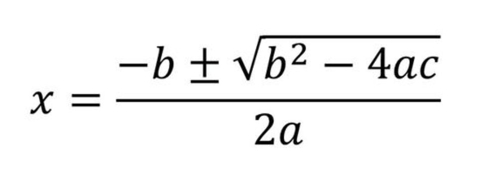

# 🧮 一元二次方程式 (題目編號：002)

一元二次方程式：`ax^2 + bx + c = 0`  
輸入 `a`, `b`, `c`，求方程式的兩個實根。

## 📥 輸入說明：
1. 第一個數 (int) `a`  
2. 第二個數 (int) `b`  
3. 第三個數 (int) `c`  

## 📤 輸出說明：

1. 第一個實根 `x1 = ((-b) + math.sqrt(b*b - 4*a*c)) / (2*a)`  
2. 第二個實根 `x2 = ((-b) - math.sqrt(b*b - 4*a*c)) / (2*a)`  
3. `x1`、`x2` 均輸出至小數點後一位  

## ✨ 範例程式

~~~python
import math

def main():
    # 輸入
    a = int(input())
    b = int(input())
    c = int(input())

    # 計算判別式
    discriminant = b * b - 4 * a * c

    # 計算兩個實根
    x1 = (-b + math.sqrt(discriminant)) / (2 * a)
    x2 = (-b - math.sqrt(discriminant)) / (2 * a)

    # 輸出結果（使用 f-string，保留小數點 1 位）
    print(f"x1 = {x1:.1f}")
    print(f"x2 = {x2:.1f}")

if __name__ == "__main__":
    main()
~~~

## 📚 延伸學習：`import math`

### 🧮 `math` 模組常用函式

| 類別 | 函式名稱 | 說明 | 範例輸入 | 範例輸出 |
|:------|:-----------|:-----------|:-----------|:-----------|
| 平方根 | `sqrt(x)` | 回傳 x 的平方根 | `math.sqrt(9)` | `3.0` |
| 次方 | `pow(x, y)` | 回傳 x 的 y 次方 | `math.pow(2, 3)` | `8.0` |
| 取整數 | `floor(x)` / `ceil(x)` | 向下 / 向上取整 | `math.floor(3.7)` / `math.ceil(3.2)` | `3` / `4` |
| 絕對值 | `fabs(x)` | 回傳絕對值（浮點數） | `math.fabs(-5)` | `5.0` |
| 餘數 | `fmod(x, y)` | 回傳 x ÷ y 的餘數（浮點型） | `math.fmod(7, 3)` | `1.0` |
| 三角函數 | `sin(x)`、`cos(x)`、`tan(x)` | 輸入為「弧度」 | `math.sin(math.pi/2)` | `1.0` |
| 反三角函數 | `asin(x)`、`acos(x)`、`atan(x)` | 回傳角度的弧度值 | `math.degrees(math.asin(1))` | `90.0` |
| 角度轉換 | `radians(x)` / `degrees(x)` | 度 ↔ 弧度 轉換 | `math.radians(180)` | `3.14159` |
| 對數 | `log(x)` / `log10(x)` | 自然對數 / 以 10 為底對數 | `math.log(10)` | `2.302...` |
| 常數 | `pi`、`e` | 圓周率與自然常數 | `math.pi` / `math.e` | `3.14159` / `2.71828` |
| 無窮與非數 | `inf`、`nan` | 無窮大 / 非數值常數 | `math.inf` / `math.nan` | `∞` / `NaN` |
